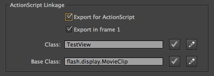
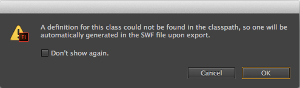
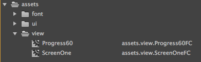
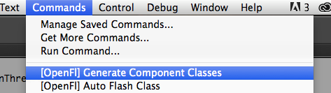

openfl-generate-component-class
===============================

A simple way to generate flash component classes for assets later used in [OpenFl](http://www.openfl.org/) in combination with [OpenFl SWF](https://github.com/openfl/swf)

-----

## swf
===============================
_Provides SWF parsing and rendering for C++, Flash and HTML5_


## WIP
===============================
this should work with Flash and C++

not tested with html (yet)


## Using Flash for layout
===============================
If you want to use assets from Flash in Openfl via swf, you need to export a library item with `Export for ActionScript` checked in the `Symbol Properties`



Proceed as normal you will get this default message (if you didn't disabled it before):



which works great for Flash, but not for C++ (html not tested).

Normally I use Flash to position my assets
When you use Flash for layout, it's a lot of work to 'find' all the assets used in the Movieclip when you use C++ as a target

**example**

```
var layout = Assets.getMovieClip ("layout:Layout");
addChild (layout);
var _bg     = cast (layout.getChildByName ("Background"), MovieClip);
var _header = cast (layout.getChildByName ("Header"), MovieClip);
var _colomn = cast (layout.getChildByName ("Column"), MovieClip);
```			


It's easier to wrap the assets in a class with the correct data.

[see example class](https://github.com/MatthijsKamstra/openfl-generate-component-class/blob/master/example/fla/swf/assets/view/HulkFC.hx)


**path**

If you use packagename for the assets (for example : `assets.view.HulkFC`)

To prevent a stackoverflow the packagename `swf` is added

`assets.view` will become `swf.assets.view`


## jsfl files
===============================
**[OpenFl] Generate Component Classes.jsfl**

Find all library items with class definitions that don't have class files and create the class files complete with imports and references for clips on the timeline.

save as:
[OpenFl Generate Component Classes.jsfl](https://raw.githubusercontent.com/MatthijsKamstra/openfl-generate-component-class/master/jsfl/%5BOpenFl%5D%20Generate%20Component%20Classes.jsfl)

_How to use:_

run the script (`Command > [OpenFl] Generate Component Classes.jsfl`)
and next to the FLA the class will be generated

**[OpenFl] Auto Flash Class.jsfl**

Add a Linkage class (path) and (if needed) baseclass to the library items, name of class is based upon folder structure in the library of the FLA

save as:
[OpenFl Auto Flash Class.jsfl](https://raw.githubusercontent.com/MatthijsKamstra/openfl-generate-component-class/master/jsfl/%5BOpenFl%5D%20Auto%20Flash%20Class.jsfl)

_How to use:_

select the items in the libary and start script (`Command > [OpenFl] Auto Flash Class.jsfl`)
if files are in folders the folder path will be generated into the Linkage class




## Installing JSFL Scripts
===============================
Find your Flash configuration folder:

**On the Mac**: Navigate to `~/Library/Application Support/Adobe/Flash CC/en_US/Configuration/`

**On the PC**: Navigate to boot drive `\Program Files\Adobe\Flash CC\en_US\Configuration\`

Locate the `Commands` folder and copy your JSFL script in there.
Go back to Flash, and look in the Commands menu. You should see your new script show up in there.



